# 📊 Panduan Lengkap Diagram & Notasi (Mermaid & PlantUML)

Dokumen ini berisi kumpulan contoh diagram dan notasi data yang didukung oleh Mermaid dan PlantUML, lengkap dengan penjelasan detail fungsinya.

---

## 🏗️ 1. Diagram UML Dasar

### A. Sequence Diagram (Mermaid)
Digunakan untuk memvisualisasikan urutan interaksi antar objek dalam rentang waktu tertentu.

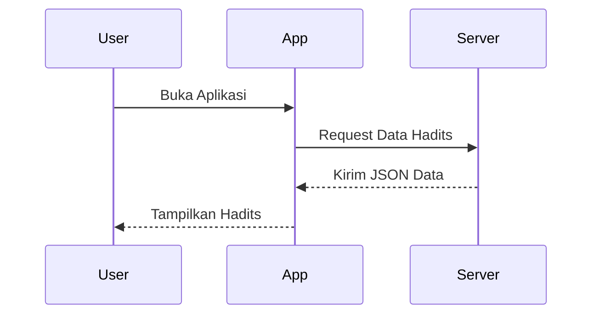

### B. Class Diagram (Mermaid)
Menjelaskan struktur sistem dengan menunjukkan kelas, atribut, metode, dan hubungan antar objek.

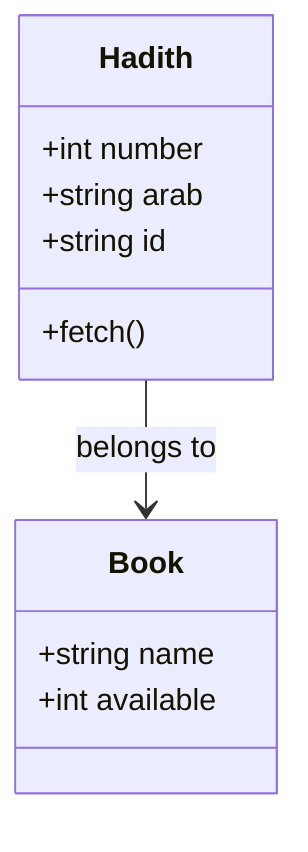

### C. Use Case Diagram (PlantUML)
Menggambarkan interaksi antara aktor (pengguna) dengan sistem.

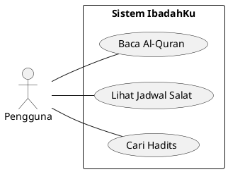

### D. Activity Diagram (PlantUML - Legacy & New)
Menggambarkan alur kerja (workflow) atau aliran kontrol dalam sistem.

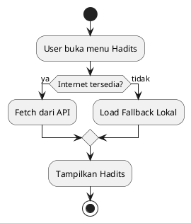

---

## 🛠️ 2. Diagram Teknis & Arsitektur

### A. Component & Deployment Diagram (PlantUML)
**Component**: Menunjukkan unit kode pembentuk sistem.
**Deployment**: Menunjukkan konfigurasi fisik perangkat keras dan perangkat lunak.

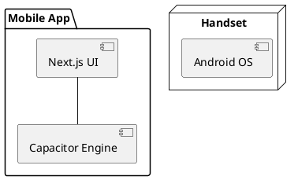

### B. Network Diagram (nwdiag - PlantUML)
Digunakan untuk memetakan infrastruktur jaringan.

```plantuml
@nwdiag
{
  network DMZ {
    address = "210.x.x.x/24"
    web01 [address = "210.x.x.1"];
    web02 [address = "210.x.x.2"];
  }
  network Internal {
    web01;
    web02;
    db01 [address = "172.x.x.1"];
  }
}
```

### C. Entity Relationship Diagram (Mermaid)
Menunjukkan hubungan antar entitas dalam database (IE Notation).

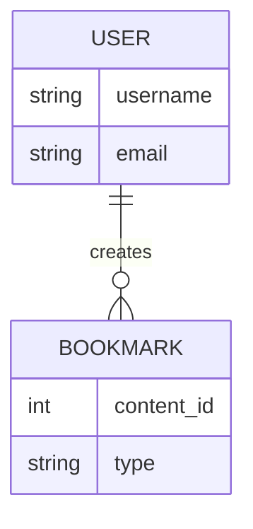

---

## 🎨 3. Visualisasi Data & Mockup

### A. JSON & YAML Representation
Data terstruktur untuk pertukaran informasi.

**JSON:**
```json
{
  "book": "Bukhari",
  "number": 1,
  "content": "Innamal a'malu binniyat..."
}
```

**YAML:**
```yaml
app: IbadahKu
version: 1.0.0
features:
  - Quran
  - Hadith
  - Prayer Times
```

### B. UI Mockups (Salt - PlantUML)
Membuat kerangka layar (wireframe) GUI dengan cepat.

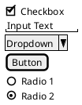

### C. MindMap & WBS (Mermaid)
**Mindmap**: Pemetaan pikiran/ide.
**WBS**: Work Breakdown Structure (Struktur Kerja).

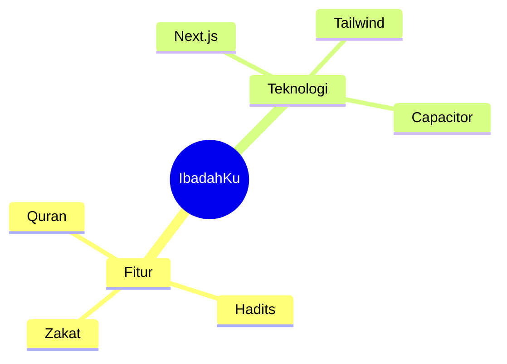

---

## 📅 4. Manajemen Proyek & Kronologi

### A. Gantt Chart (Mermaid)
Visualisasi jadwal proyek dan dependensi tugas.

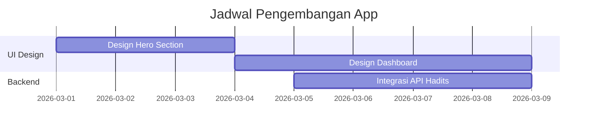

### B. Timeline / Chronology (Mermaid)
Menunjukkan urutan peristiwa berdasarkan waktu.

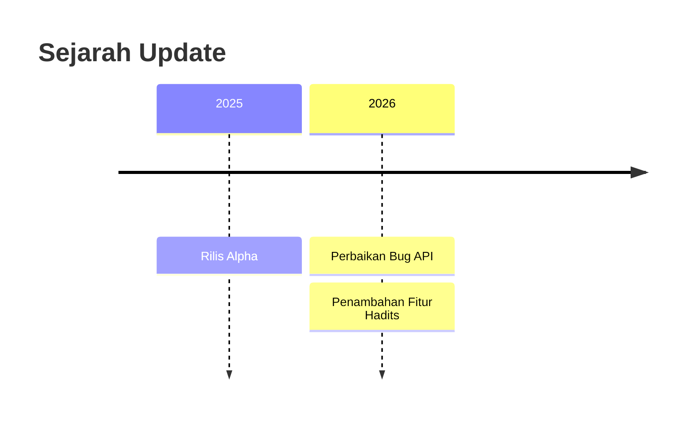

---

## 🔢 5. Notasi Matematika & Diagram Khusus

### A. Mathematics (LaTeX/AsciiMath)
Digunakan untuk rumus zakat atau perhitungan ilmiah lainnya.

$$
Zakat = 2.5\% \times (Harta - Hutang)
$$

### B. Regex Diagram
PlantUML dapat merepresentasikan logika regex melalui diagram State.

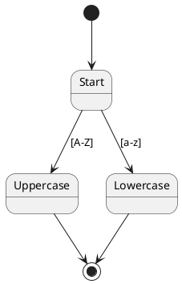

### C. Ditaa Diagram
Diagram ASCII yang dirender menjadi gambar grafis.

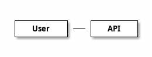

---

## 📝 Penjelasan Detail Diagram

1.  **Sequence**: Fokus pada **waktu**. Siapa memanggil siapa dan kapan.
2.  **State**: Fokus pada **status**. Perubahan dari "Loading" ke "Success/Error".
3.  **Salt (GUI)**: Sangat berguna untuk diskusi desain awal tanpa harus coding UI.
4.  **nwdiag**: Penting bagi tim DevOps untuk memahami topologi server.
5.  **Ditaa**: Cocok untuk sketsa cepat bergaya retro namun rapi.
6.  **SDL & Archimate**: Standar industri tinggi untuk spesifikasi telekomunikasi dan arsitektur enterprise besar.
7.  **Timing Diagram**: Fokus pada perubahan pulse/signal (biasanya untuk hardware/IoT).

---
*Dibuat oleh Assistant untuk IbadahKu Project*
